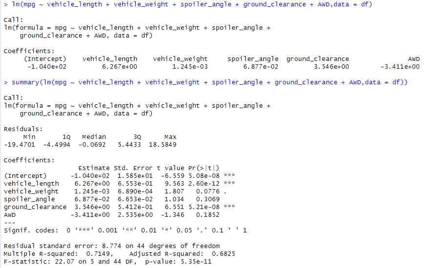
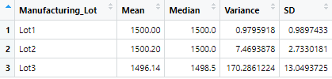
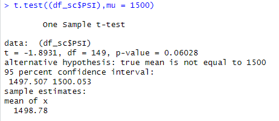
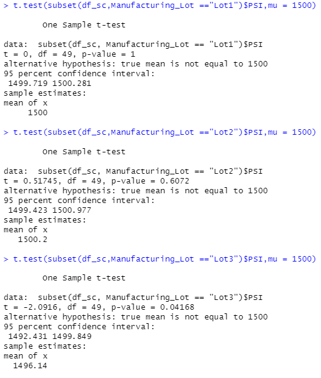

# MechaCar_Statistical_Analysis

## Linear Regression to Predict MPG

- In the calculations made, the vehicle length and ground clearance coefficients appear to provide a non-random amount of variance to the mpg values.

- The slope would not be considered to be 0 since the p-value is 5.35e-11. Thus the null hypothesis can be rejected.

- With the multiple r-squared value being .7149, meaning roughly 71% of all mpg predictions will be correct, the linear model predicts the mpg of MechaCar prototypes relatively well.

## Summary Statistics on Suspension Coils

The overall variance for the dataset in its entirety indicates the current data meets the 100 pounds per square inch variance limitation. However, when separated into lots, the third lot shows a higher variance tht is over the acceptable threshold.

## T-Tests on Suspension Coils

The results of the T-test for the suspension coils across all lots show they are not statistically different from the normal distribution and the p-value at 0.06028 is not low enough to reject the null hypothesis.

When broken down into lots, the results show that the first and second lots are not statistically different from the normal distribution, and so normality can be assumed. However, lot three shows a p-value of .04, which since it is less than .05 shows it is statistically significant from the normal distribution and is low enough to reject the null hypothesis. Because of this, the third lot may have to be more closely evaluated.

## Study Design: MechaCar vs Competition

An additional study that could be designed would be testing for maintenance costs versus the competition. 

- In this scenario, the null hypothesis is that there is not significant cost differneces between the MechaCar and the competition.
The alternative hypothesis would be there is a significant cost difference against the competition.

- A multiple linear regression test could be used for this to test for multiple variables to better answer the question.

- Data needed to run the statistical test would include the cost of oil changes and replacement parts and the frequency of needing to replace parts associated with the cars.
